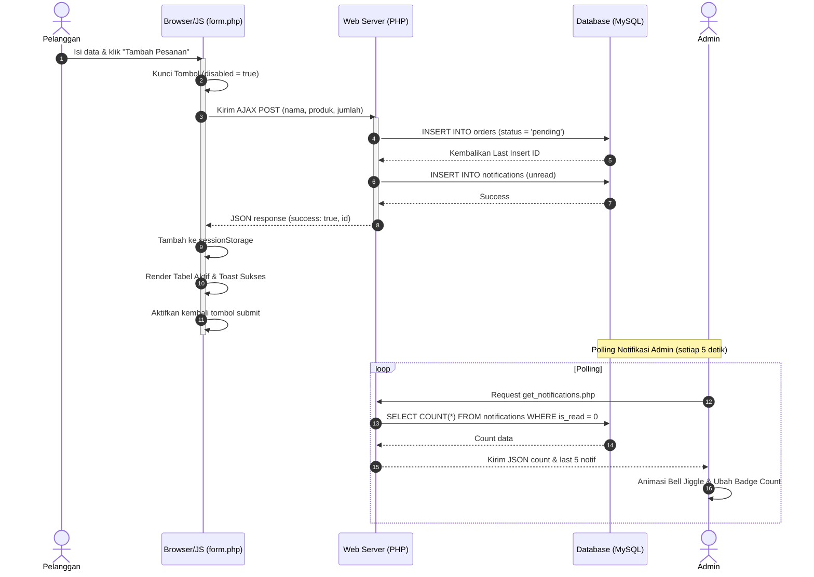

# Panduan Persiapan Pengumpulan EAS – Bake'n Brew

Dokumen ini disusun untuk membantu kelompok Anda melengkapi seluruh berkas wajib pengumpulan **Evaluasi Akhir Semester (EAS)** sesuai dengan rubrik penilaian dosen.

---

## 📊 1. Draf Laporan & Diagram UML (Mermaid format)
*Anda dapat menyalin kode Mermaid di bawah ini ke editor markdown atau menggunakan [Mermaid Live Editor](https://mermaid.live/) untuk mengekspor gambar diagram.*

### A. Diagram Use Case
Menjelaskan interaksi antara Aktor Pelanggan (Customer) dan Admin dengan sistem Bake'n Brew.

```mermaid
usecaseDiagram
    actor Pelanggan as "Pelanggan (Customer)"
    actor Admin as "Admin (Backend)"

    rect "Sistem Bake'n Brew"
        usecase UC1 as "Melihat Katalog Produk"
        usecase UC2 as "Membuat Pesanan (Checkout)"
        usecase UC3 as "Melihat Sesi Pesanan Pribadi"
        usecase UC4 as "Menerima Status Toko (Buka/Tutup)"
        
        usecase UC5 as "Login Akun Admin"
        usecase UC6 as "Mengelola Produk (CRUD Menu)"
        usecase UC7 as "Mengelola Pesanan (Tandai Selesai/Hapus)"
        usecase UC8 as "Mengubah Status Operasional Toko"
        usecase UC9 as "Mengatur Preferensi Sistem (Bahasa/Suara)"
    end

    Pelanggan --> UC1
    Pelanggan --> UC2
    Pelanggan --> UC3
    Pelanggan --> UC4

    Admin --> UC5
    Admin --> UC6
    Admin --> UC7
    Admin --> UC8
    Admin --> UC9
```

### B. Diagram Activity
Menggambarkan alur aktivitas transaksi pemesanan dari pelanggan hingga diproses oleh admin.

```mermaid
activityDiagram
    start
    :Pelanggan membuka form.php;
    if (Status Toko?) then (Tutup / Offline)
        :Form terkunci (disabled);
        :Tampilkan Alert Warning;
        stop
    else (Buka)
        :Pelanggan mengisi Form Order;
        :Pelanggan klik "Tambah Pesanan";
        :JS mengunci tombol (Double Submit Protection);
        :Kirim AJAX POST ke form.php;
        :Simpan pesanan di DB & Sesi Browser;
        :Trigger Notifikasi Real-time;
        :Sistem merender tabel order pelanggan;
    endif
    
    partition Panel Admin {
        :Admin menerima notifikasi (Bell Jiggle & Count);
        :Admin membuka pesanan.php;
        :Admin klik tombol "Tandai Selesai";
        :Database memperbarui status menjadi 'completed';
    }
    
    :Status pesanan pelanggan sinkron otomatis (hilang dari aktif);
    end
```

### C. Diagram Sequence
Menjelaskan interaksi pesan antar objek/halaman saat pelanggan membuat pesanan hingga konfirmasi di sisi admin.



---

## 📸 2. Checklist Halaman untuk Dokumen Screenshot (SS UI)
*Pastikan Anda mengambil tangkapan layar (screenshot) untuk seluruh halaman berikut demi kelengkapan laporan:*

### Sisi Pengguna (Frontend)
1. **Home Page (`index.php`) - Status Buka:** SS penuh halaman dengan navbar ber-badge hijau **Buka**.
2. **Home Page (`index.php`) - Status Tutup:** SS banner merah *"Maaf, kami sedang tutup..."* di bagian bawah browser saat admin menutup toko.
3. **Katalog Menu (`product.php`):** SS grid katalog yang rapi dengan lencana Best Seller/New.
4. **Katalog Menu (`product.php`) - Offline Mode:** Matikan MySQL lalu SS halaman produk yang menampilkan banner warning kuning *"Koneksi Database Offline..."*.
5. **Form Pemesanan (`form.php`) - Terisi:** SS form order terisi lengkap sesaat sebelum disubmit.
6. **Form Pemesanan (`form.php`) - Sukses:** SS pop-up Toast notifikasi sukses dan baris tabel pesanan baru di bagian bawah.
7. **Form Pemesanan (`form.php`) - Terkunci Tutup:** SS form saat toko tutup (semua input buram/disabled) dengan banner merah di atasnya.
8. **Form Pemesanan (`form.php`) - Terkunci Offline:** SS form saat database offline (semua input buram/disabled) dengan banner kuning di atasnya.

### Sisi Admin (Backend)
1. **Login Page (`admin/login.php`):** SS kartu login admin yang bersih.
2. **Dashboard (`admin/dashboard.php`):** SS statistik, toggle operasional, diagram rasio menu, dan tabel pesanan terbaru.
3. **Dashboard - Offline Mode:** SS dashboard saat MySQL mati yang menampilkan alert warning kuning dan tombol toggle yang terkunci (disabled).
4. **Manage Menu (`admin/produk.php`):** SS tabel menu yang rapi (dengan gabungan kolom foto thumbnail & nama menu horizontal).
5. **Manage Orders (`admin/pesanan.php`):** SS tabel pesanan pelanggan masuk, tombol centang selesai, dan filter pencarian.
6. **View Profile (`admin/profil.php`):** SS profil admin (termasuk upload avatar WebP dan dropdown Language Switcher).

---

## 📹 3. Naskah & Alur Rekaman Demo (Record Demo Script)
*Gunakan alur 3 menit berikut untuk merekam video demonstrasi proyek yang padat dan terstruktur:*

* **Menit 0.00 - 0.30 (Pembukaan & Sisi Pelanggan):**
  * Tunjukkan halaman beranda `index.php`. Jelaskan judul projek "Bake'n Brew".
  * Buka `product.php`, tunjukkan filter kategori (klik Bakery/Coffee) yang bergerak mulus.
* **Menit 0.30 - 1.15 (Transaksi & Real-time Notif):**
  * Beralih ke `form.php`. Isi form pemesanan dengan lengkap.
  * Tekan tombol order. **Tunjukkan tombol submit terkunci sesaat (Double Submit Protection)** dan muncul toast sukses.
  * Tunjukkan data langsung ter-render di tabel bagian bawah.
* **Menit 1.15 - 2.15 (Panel Admin & Pemrosesan):**
  * Login ke `/admin/login.php`.
  * **Tunjukkan lonceng notifikasi bergoyang (jiggle)** dan badge merah bertambah setelah pesanan tadi dikirim.
  * Klik notifikasi untuk langsung menuju `/admin/pesanan.php`.
  * Klik centang hijau "Selesai" untuk memproses pesanan menjadi Completed.
  * Tunjukkan menu `/admin/produk.php` dengan tata letak thumbnail horizontal premium yang terkompresi WebP.
  * Masuk ke `/admin/profil.php`, tunjukkan **Language Switcher** yang mengubah bahasa panel admin secara instan dari Inggris ke Indonesia.
* **Menit 2.15 - 3.00 (Pengujian Kondisi Ekstrem - Offline):**
  * Beralih ke dashboard admin, matikan toggle status menjadi **TUTUP**.
  * Tunjukkan di frontend pelanggan, form order langsung terkunci otomatis dengan banner merah.
  * Matikan MySQL di Laragon. Tunjukkan bahwa frontend pelanggan tidak mengalami error crash, melainkan menampilkan banner kuning offline dengan mock data produk tetap aman.
  * Tunjukkan di sisi admin tombol-tombol CRUD terkunci saat offline. Penutup.

---

## 🚀 4. Panduan Deploy Projek PHP + MySQL Gratis (Go-Live)
*Untuk kebutuhan pengumpulan link deploy EAS, gunakan layanan hosting gratis **InfinityFree** yang andal dan mendukung PHP-MySQL.*

### Langkah 1: Ekspor Database Lokal
1. Buka **phpMyAdmin** di Laragon/XAMPP Anda (`http://localhost/phpmyadmin` atau melalui menu Laragon Database).
2. Pilih database `db_bakenbrew`.
3. Klik tab **Export / Ekspor**, lalu klik **Go / Kirim**. Simpan file `.sql` tersebut ke komputer Anda.

### Langkah 2: Registrasi & Setup Hosting Gratis
1. Buka [InfinityFree](https://infinityfree.net/) dan buat akun gratis.
2. Buat akun hosting baru (*Create Hosting Account*), pilih subdomain gratis (contoh: `bakenbrew.infy.uk`).
3. Buka panel kontrol (*Control Panel / vPanel*) akun hosting baru Anda.

### Langkah 3: Import Database di Hosting
1. Di Control Panel InfinityFree, cari menu **MySQL Databases**.
2. Buat database baru bernama `db_bakenbrew` (InfinityFree akan memberikan prefix otomatis, contoh: `if0_xxxxxx_db_bakenbrew`).
3. Catat detail database: **DB Name**, **DB User**, **DB Password**, dan **DB Host** yang disediakan.
4. Kembali ke Control Panel, klik menu **phpMyAdmin** untuk database tersebut.
5. Klik tab **Import / Impor**, pilih file `.sql` lokal Anda, lalu klik **Go** untuk mengunggah seluruh tabel produk dan pesanan.

### Langkah 4: Sesuaikan Koneksi Database
1. Buka folder projek lokal Anda, edit berkas `config/koneksi.php`.
2. Ganti variabel koneksi dengan detail database dari InfinityFree:
   ```php
   $host = 'sqlXXX.infinityfree.com'; // Isi sesuai DB Host InfinityFree Anda
   $user = 'if0_XXXXXX';              // Isi sesuai DB User
   $pass = 'your_infinity_password';   // Isi sesuai DB Password
   $db   = 'if0_XXXXXX_db_bakenbrew';  // Isi sesuai DB Name
   ```
3. Jangan khawatir, jika database hosting down di kemudian hari, sistem failover Anda akan otomatis berjalan.

### Langkah 5: Upload File via File Manager
1. Di Control Panel InfinityFree, buka **Online File Manager**.
2. Masuk ke direktori **`htdocs`**.
3. Unggah seluruh berkas dan folder projek Bake'n Brew Anda ke dalam direktori `htdocs` tersebut (bisa dengan drag-and-drop atau dikompres ke zip terlebih dahulu lalu di-extract di File Manager).
4. Selesai! Akses URL subdomain Anda untuk memverifikasi situs Anda telah online.
